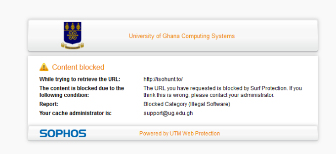

title: VPN Usage- Bypass Web Blocks
date: 2014-10-13
tags: [general, internet, security]
date-format: YYYY-MM-DD
published: True
subtitle: Simple trick to by pass blocked content. This was what i did when i cannot torrent or access some websites. The internet is suppose to be free, as in free beer.

## Content Blocked?
Why? I want to browse, I want to download this  Korean series. Sophos UTM the university deployed is getting annoying and it blocks almost every site. While this is good for our security, we also need to entertain ourselves with movies. 

This is the page you would see when then content is blocked. Why not stand out and have your way freely amidst restricted internet. I would explain in details web protection and would suggest simple tricks to bypass this Sophos thing.
[Introduction, UG WEB, Advantages, Solutions, Recommendations]

Internet security it’s an issue all of us must be concerned with regarding our ever presence on with our Phones and Computers. We must be personally concerned about the security of WiFi we are connected to, the website we are visiting- are they stealing our personal data and selling it out to others for money among others.

Privacy online is a right not a privileged. To avoid bothering you with a lot of technical stuff, let jump straight to business.

The University of Ghana has been faced with a lot of Web Attacks (Hacks) recently. Several websites hosted by the university has been compromised in one form or the other. the IT staffs need some level of restrictions and protection on the University networks in order to reduce the level of attacks. I believe the reasons the deployed Sophos Internet Security are not far from the ones stated above.

The students and other internet users on campus are in disagreement with the website blocks or restrictions. Simply because our downloads have to pass through a restricted server which filters off most of our online activities.

This, however, is a major issue to others while the hackers would find their way around. The tool to do this job is VPN(Virtual Private Network).

VPN is a tool that creates an anonymous connection between your computer and the internet. There are several VPNs tools out there. Some are paid while others allow
you to try it for a week or month etc. In all instances, we can bypass the restrictions and use torrents as never before. You could also set up your own OpenVPN or IPSec

 ## The advantages of VPN include the following advantages:

Enhanced security. When you connect to the network through a VPN, the data is
kept secured and encrypted. In this way, the information is away from hackers’
eyes.

Through a VPN you can browse the web in complete anonymity. Compared to hide IP
software or web proxies, the advantage of a VPN service is that it allows you
to access both web applications and websites in complete anonymity.

### Unblock -websites & bypass filters.

VPNs are great for accessing blocked websites or for bypassing Internet filters.
This is why there is an increased number of VPN services used in countries
where Internet censorship is applied.

_Fake IPs:_ If you need an IP address from another country, then a VPN can provide you with this.

_Torrenting Allowed:_ VPNs allow you to torrent and makes your internet faster.

_Better performance:_ Bandwidth and efficiency of the network can be generally increased once a VPN solution is implemented. Reduce costs.

## Solutions

ZenVPN- It's a technology that allows you to access the Internet as if you were connecting from a different point in the world. This means, among other things that your local ISP/network operator cannot inspect or filter your traffic(in a basic way) and that for any website you will appear as having a different IP address.

Hotspot Shield - Hotspot Shield's free VPN protects your privacy, unblocks websites & hides your IP so you can surf anonymously. There are premium and trial versions.

VPNUnlimited - This is what they: The primary goal of VPN Unlimited is not to download torrents, but to offer online security. There are limited cases when our technical team had to decrease the connection speed because of torrenting. We allow legal use of P2P file sharing on US-California 1, Romania, Luxembourg, France, Canada-East servers. This is supported on both Windows and Mac

Cyberghost -If you want to surf anonymously, CyberGhost VPN is your best option. We hide your IP address and replace it with one of ours, which you will share with others. This
way, no one will know who you are, or even what country you live in. What’s
more, We don’t track or store any logs from our users, so your identity is a
complete mystery to us, too.

The choice and plan of VPN are dependent on your security expectations and how much you are willing to spend. Hotspot shield includes ads. However, ZenVpn has no ads so you can give them a try before buying one.

ZenVpn for Free
I love the free edition because it's for pirates. ZenVpn requires your email to set it up. After the first usage, you can just create another email that's if you are not ready to move to premium. 

If you have money, just buy the premium edition because engineers must eat.

Developers Must Eat.

The only way to enjoy internet freedom on Legon campus is to
set up a VPN service. Am currently running Hotspot Shield Lite on my PC
